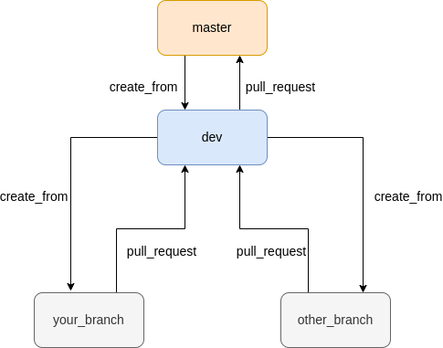

## Create new branch

```
git checkout -b <branch_name> dev
```

## Pull request

Flow conventions for creating branches and pull requests



## Run project

### Install dependency packages

```
npm install
```

### Run

```
npm start
```

### Graph of web project <a href="https://www.mindmeister.com/map/2463148031">click here</a>
