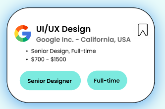
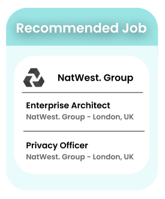

## sử dụng components public

### HighlightJob trong folder highlight-job

Chuyển


sang



Các tham số đầu vào:

```argument
<HighlightJob
    // class = {classes.red}
    logo = {job.logo}
    companyName = {job.companyName}
    location = {job.location}
    category = {job.category}
    jobType = {job.jobType}
    skills = {job.skills}
    experience = {job.experience}
    salary = {job.salary}
/>
```

Ví dụ object:

```object
{
id: 1,
logo: locationImg,
companyName: 'Google Inc',
location: 'California',
category: 'UI/UX Desgin',
jobType: 'Part Time',
experience: 'Senior',
salary: '700',
skills: ['cloud', 'react'],
}
```

### RecomendedJob trong folder recomended-job



```argument
<RecomendedJob 
    key={item.id}
    companyName={item.companyName}
    logo = {item.logo}
    jobs = {item.jobs}
/>
```
Ví dụ object:

```object
{
    id: '1',
    companyName: 'Google Inc',
    logo: locationImg,
    jobs: [{
        id: '1',
        category: 'UI/UX Desgin',
        jobType: 'Part Time',
        location: 'California',
    }, {
        id: '2',
        category: 'UI/UX Desgin',
        jobType: 'Part Time',
        location: 'California',
    }]
}
```


